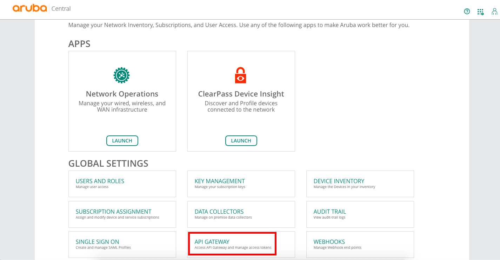
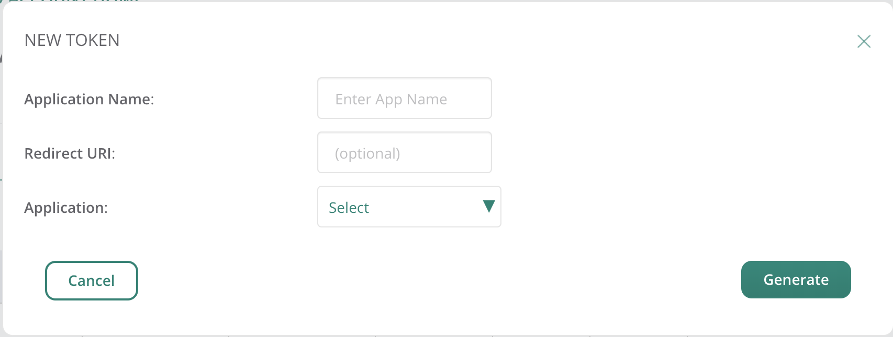
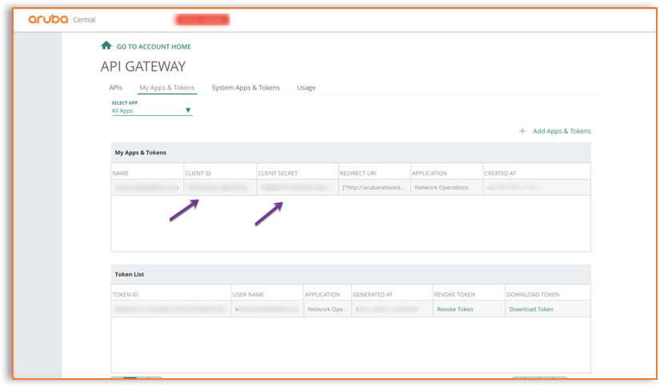
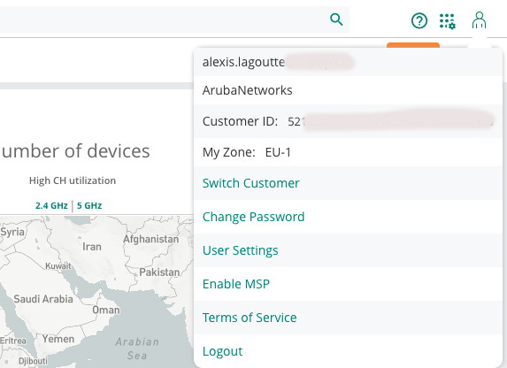

# PowerArubaCP

This is a Powershell module for manage Aruba Central

<p align="center">

</p>

With this module (version 0.1.0) you can manage:

- [Inventory](#Inventory) (Add/Get Devices, Add/Get/Remove Archived Devices)

There is some extra feature
- [Invoke API](#Invoke-API)
- [Multi Connection](#MultiConnection)

More functionality will be added later.

Tested with Aruba Central ( Region EU-1 )

# Usage

All resource management functions are available with the Powershell verbs GET, ADD, SET, REMOVE.  
<!--For example, you can manage NAS (NetworkDevice) with the following commands:
- `Get-ArubaCPNetworkDevice`
- `Add-ArubaCPNetworkDevice`
- `Set-ArubaCPNetworkDevice`
- `Remove-ArubaCPNetworkDevice`
-->
# Requirements

- Powershell 5 or 6.x/7.x (Core) (If possible get the latest version)
- An Aruba Central Account

# Instructions
### Install the module
```powershell
# Automated installation (Powershell 5 and later):
    Install-Module PowerArubaCL

# Import the module
    Import-Module PowerArubaCL

# Get commands in the module
    Get-Command -Module PowerArubaCL

# Get help
    Get-Help Add-ArubaCLInventoryDevices -Full
```

# Examples

### Connecting to Aruba Central using API

The first thing to do is to get API client_id/client_secret and customer_id

Go on WebGUI of your Aruba Central, on API Gateway (in the Account Home Page)
  
Go on `My Apps & Tokens` or `System Apps & Tokens` (for Admin Account) and click on `Add Apps & Tokens`

  
Create a `New Token`
- Application: an application name (for example PowerArubaCL)
- Redirect URI: empty (it is optional)
- Application: Network Operations

Click on `Generate`

  
now copy `Client ID` and `Client Secret`, you will need for connect

Go now on the configuration for get the customer id
it is available on the top right 
  
Copy `Customer ID` value


After connect to Aruba Central with the command `Connect-ArubaCL` :

```powershell
# Connect to the Aruba Central using Token
    Connect-ArubaCL -region EU-1 -client_id MyClientId -client_secret MyClientSecret -customer_id MyCustomerId

    PowerShell credential request
    Please enter administrative credential for your Aruba Central
    User: cl@poweraruba.net
    Password for user cl@poweraruba.net: **********
    Name                           Value
    ----                           -----
    session                        Microsoft.PowerShell.Commands.WebRequestSession
    invokeParams                   {}
    server                         eu-apigw.central.arubanetworks.com
    access_token                   565kubYCyDEEaJ4s3zs40yvgtxGTG4Lv
    headers                        {Content-type, Accept, Authorization}
```

### Inventory

You can get Inventory Devices

```powershell
# get IAP Devices
    Get-ArubaCLInventoryDevices -type IAP

    aruba_part_no : AP-505-RW
    customer_id   : 987b69ccdfb03124feeb4a847b9f54d2
    customer_name : PowerArubaCL
    device_type   : iap
    imei          : 
    macaddr       : B8:3A:5A:1C:22:1C
    model         : R2H28A
    serial        : CNJNK0N7PP
    services      : {}
    tier_type     :
    ...

# Add Devices (need to known Mac Address and Serial Number)
    Add-ArubaCLInventoryDevices -mac FC:7F:F2:88:11:22 -serial CNLBAD3C5DT

    success

# Get Archived Devices
    Get-ArubaCLInventoryDevicesArchive

    aruba_part_no : AP-505-RW
    customer_id   : 987b69ccdfb03124feeb4a847b9f54d2
    customer_name : PowerArubaCL
    device_type   : iap
    imei          :
    macaddr       : B8:3A:5A:1C:22:1C
    model         : R2H28A
    serial        : CNJNK0N7PP


# Add Devices to Archive (need to known Serial Number)
    Add-ArubaCLInventoryDevicesArchive -serial CNJNK0N7PP

    success

# Remove Devices to Archive (need to known Serial Number)
    Remove-ArubaCLInventoryDevicesArchive -serial CNJNK0N7PP

    success

```


### Invoke API
for example to get 

```powershell
# get list of Group

    Invoke-ArubaCLRestMethod -uri "configuration/v2/groups?limit=20&offset=0"

    data                           total
    ----                           -----
    {MyPowerArubaCL-Group}             1
```


to get API uri, go to Aruba Central Swagger (https://eu-apigw.central.arubanetworks.com/swagger/central)
(need to be connected)

### MultiConnection

it is possible to connect on same times to Aruba Central account
You need to use -connection parameter to cmdlet

For example to get Devices for 2 different Aruba Central account

```powershell
# Connect to first Aruba Central Account
    $cl1 = Connect-ArubaCL -Region EU-1 -DefaultConnection:$false

#DefaultConnection set to false is not mandatory but only don't set the connection info on global variable

# Connect to second Aruba Central Account
    $cl2 = Connect-ArubaCL -Region EU-1 -DefaultConnection:$false

# Get number of Devices of first Aruba Central Account
    (Get-ArubaCLInventoryDevices -type IAP -connection $cl1).count

    80

# Get number of Devices of Second Aruba Central Account
    (Get-ArubaCLInventoryDevices -type IAP -connection $cl2).count

    90

#Each cmdlet can use -connection parameter
```

### Limit
Following API call, it is possible to have a limit return result.
For Example Get-ArubaCLInventoryDevices return by default only the 50th first devices.
if there is more of 50 devices, you get a warning,
```powershell
    (Get-ArubaCLInventoryDevices -type IAP).count
    WARNING: There is extra items use -limit parameter to display
    50
```

it is possible to specific the limit and the offset

```powershell
    (Get-ArubaCLInventoryDevices -type IAP -limit 1000).count
    365
```

For `Invoke-ArubaCLRestMethod`, you can also use limit and offset parameter

### Disconnecting

```powershell
# Disconnect from Aruba Central
    Disconnect-ArubaCL
```


# How to contribute

Contribution and feature requests are more than welcome. Please use the following methods:

  * For bugs and [issues](https://github.com/PowerAruba/PowerArubaCL/issues), please use the [issues](https://github.com/PowerAruba/PowerArubaCL/issues) register with details of the problem.
  * For Feature Requests, please use the [issues](https://github.com/PowerAruba/PowerArubaCL/issues) register with details of what's required.
  * For code contribution (bug fixes, or feature request), please request fork PowerFGT, create a feature/fix branch, add tests if needed then submit a pull request.

# Contact

Currently, [@alagoutte](#author) started this project and will keep maintaining it. Reach out to me via [Twitter](#author), Email (see top of file) or the [issues](https://github.com/PowerAruba/PowerArubaCL/issues) Page here on GitHub. If you want to contribute, also get in touch with me.


# List of available command
```powershell
Connect-ArubaCL
Disconnect-ArubaCL
Get-ArubaCLInventoryDevices
Invoke-ArubaCLRestMethod
Set-ArubaCLCipherSSL
Show-ArubaCLException
```

# Author

**Alexis La Goutte**
- <https://github.com/alagoutte>
- <https://twitter.com/alagoutte>

# Contributors

- Cédric Moreau
- cmcknz77

Sort by name (*git shortlog -s*)

# Special Thanks

- Warren F. for his [blog post](http://ramblingcookiemonster.github.io/Building-A-PowerShell-Module/) 'Building a Powershell module'
- Erwan Quelin for help about Powershell
- François-Xavier Cat (@lazywinadmin) for [Format/Clean MAC Address](https://github.com/lazywinadmin/PowerShell/blob/master/TOOL-Clean-MacAddress/Clean-MacAddress.ps1)

# License

Copyright 2021 Alexis La Goutte and the community.
